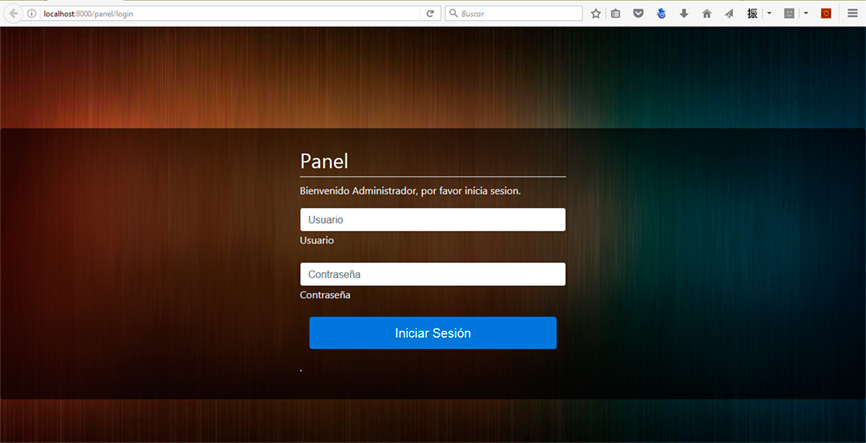

React Body Images
====================

A way to add one background image to body, or create body background slider in a single-page app. Based on Iestyn William's project react-body-className. So, you can manipulate your body's className too

This component can be use the className feature on server side as well.

Built with [React Side Effect](https://github.com/gaearon/react-side-effect).

====================

## Installation

```
npm install --save react-body-images
```

Dependencies: React >= 0.13.0

## Features

* Does not emit DOM, not even a `<noscript>`;
* Like a normal React compoment, can use its parent's `props` and `state`;
* Can be defined in many places throughout the application;
* Supports arbitrary levels of nesting, combining each className;
* Works just as well with isomorphic apps.

## Example




```jsx
class SomeComponent {
  render() {
    // This will add an array of background images to the body
	// And add className 'home' too
	// You should put the path to the image in the array.
	// var images = ["/img/image1.jpg","/img/image2.jpg"];
	// If this is a nested component you can specify if you want to show the background images or not using removeBackgroundImages property.
	// If removeBackgroundImages is true in a nested component, the background images are the specified by the main Component.
    return (
      <BodyImages className='home' bgImageArray={this.state.images} transitionSeconds={15} removeBackgroundImages{true/false}>
        <h1>Hogar, dulce hogar.</h1>
      </BodyImages>
    );
  }
}

class App {
  render() {
    // This will add an array of background images to the body
	// And add className 'app' too
	// You should put the path to the image in the array.
	// var images = ["/img/image1.jpg","/img/image2.jpg"];
	// If you want to see in the console debug comments you can specify that using inDebugMode property.
    return (
      <BodyImages className='app' bgImageArray={this.state.images} transitionSeconds={15} inDebugMode={true}>
        <SomeComponent/>
      </BodyImages>
    );
    // Becuase we nested the component, our body will now replace the background images especified in SomeComponent and have the 'app home' as the class name
  }
}
```

Use CSS modules with webpack or similar?

```jsx
import styles from './some.css';

class Thing {
  render() {
	// You should put the path to the image in the array.
	// var images = ["/img/image1.jpg","/img/image2.jpg"];
    return (
	  <BodyImages className={styles.body} bgImageArray={this.state.images} transitionSeconds={15}>
        <h1>CSS modules rock!</h1>
      </BodyImages>
    );
  }
}
```

If you need to remove the background:

```jsx
import styles from './some.css';

class Thing {
  render() {
    return (
	  <BodyImages className={styles.body} removeBackgroundImages={true}>
        <h1>CSS modules rock!</h1>
      </BodyImages>
    );
  }
}
```


## Server Usage

If you use it on server the className feature , call `BodyClassName.rewind()` **after rendering components to string** to retrieve the combined class name. You can then embed this className into HTML page template.

Because this component keeps track of mounted instances, **you have to make sure to call `rewind` on server**, or you'll get a memory leak.
